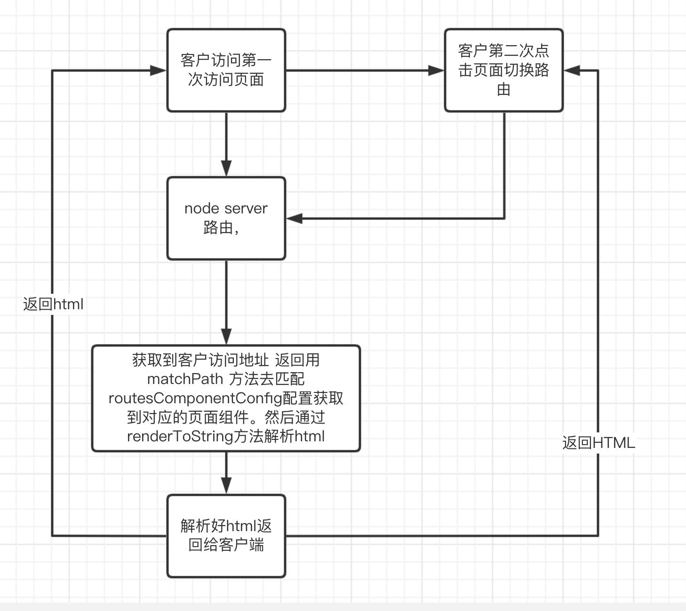
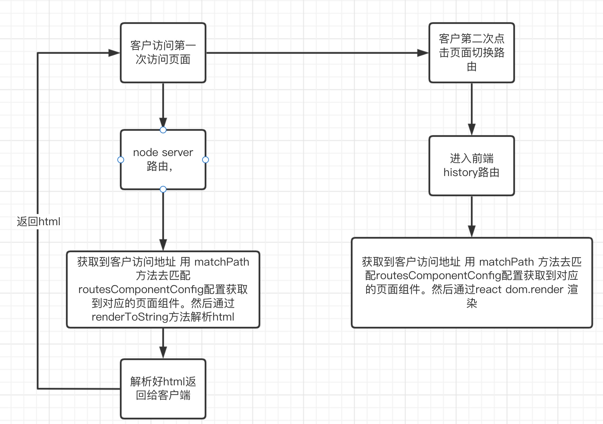

# React SSR 同构服务端渲染构架搭建

讲师：姚观寿

SSR渲染有哪些优点？

* 更友好的的首页加载访问速度，无论你是访问网站首页还是第一次访问其他页面他的速度是比传统的SCR快很多。
  * 因为减少了HTTP请求次数所以他比传统的CSR访问速度更快。
* 更友好的搜索引擎排名。
  * 传统的CSR渲染搜索引擎爬取到信息是空白页面或者模板指令，不利于解析。
  * SSR搜索引擎爬取到的是网站内容，这样搜索引擎更好的了解你的网站，如果你网站注重排名我觉得你更应该使用它

## **CSR**与**SSR**概念与区别。

## CSR：Client Side Rendering

****

浏览器(Client)渲染顾名思义就是所有的页面渲染、逻辑处理、页面路由、接口请求均是在浏览器中发生。其实，现代主流的前端框架均是这种渲染方式，这种渲染方式的好处在于实现了前后端架构分离，利于前后端职责分离，并且能够首次渲染迅速有效减少白屏时间。同时，CSR可以通过在打包编译阶段进行预渲染或者骨架屏生成，可以进一步提升首次渲染的用户体验。

但是由于和服务端会有多次交互（获取静态资源、获取数据），同时依赖浏览器进行渲染，在移动设备尤其是低配设备上，首屏时间和完全可交互时间是比较长的。

目前我们都是用MVVM开发，用的都是CSR，CSR除了渲染慢之外不利于搜索引擎蜘蛛爬取，因为搜索引擎只能爬取到静态文件对于MVVMjs渲染的内容是没办法解析的，所以搜索引擎爬取到的页面基本都是MVVM框架的指令而不是内容。

CSR渲染，如果内容是动态的， 获取内容渲染最少需要请求三次，第一次发送请求是获取到HTML，然后遇到JavaScript 脚本在发送一次请求， JavaScript脚本ajax脚本获取数据需要在再发送一次请求。


## SSR：Server Side Rendering


服务端渲染则是在服务端完成页面的渲染，在服务端完成页面模板、数据填充、页面渲染，然后将完整的HTML内容返回给到浏览器。由于所有的渲染工作都在服务端完成，因此网站的首屏时间和TTI都会表现比较好。

但是，渲染需要在服务端完成，并不能很好进行前后端职责分离，单纯的SSR渲染对于事件交互添加不友好，典型的列子为PHP 模板渲染，或者JSP模板渲染，asp模板渲染，或者node 单纯的模板渲染+JQ，这样的设计，对于代码维护并不是很理想，可能在代码中很多地方需要写两套内容判断客户端还是服务端，比如一些路由跳转，还有数据通信等问题并不是那么好实现。 

单纯SSR渲染，如果内容是动态的，则需要发送两次请求，第一次请求是客户端发送请求获取HTML，然后ssr server服务器再发一次请求到其他服务器获取到动态内容，然后ssr server组转好内容发送给客户端。客户端就可以马上展现内容了。


### 增加服务器成本与运维成本

缺点: SSR对于服务端的负载要求也会比较高。因为需要SSR需要启动一个中间服务器，维护成本也是比CSR要大。


### 优化seo搜索

优点：较少了一次请求页面加载展现会更快，还有一个更重要问题是SEO搜索更友好。由于现在开发网站都是用MVVM框架，搜索引擎不会解析JavaScript脚本，只能爬取到html内容，这样搜索引擎其实爬取到网站都是空白页面+一些MVVM指令，这些指令他们是无法识别的，这样就不能获取到更好的排名，没有排名，就等同于没有流量，没有流量的网站基本是没什么用。所以为什么很多C端网站选择SSR渲染也是这种原因。


## SSR同构思想 SSR + SPA 体验升级

SSR同构思想，就是的SSR和CSR融合。


实现 SSR 其实没啥意义，技术上没有任何发展和进步，否则 SPA 技术就不会出现

SSR和CSR均有各自的优点和缺点，因此，业界提出前后端渲染同构的方案来整合SSR和CSR。这种方案就是SSR同构。

SSR同构的原理是首页加载的时候初次访问是经过了server路由，并且server通过了ajax访问请求数据，并且拼装好HTML和JavaScript脚本之后一起发送给客户端。

客户端获取到了HTML之后，这样拿到的就不是指令内容，而是html纯文本内容，这样有利于搜索引擎渲染。通过这样的实现，可以达到和SSR相同的首屏时间。

然后客户端获取到了JavaScript脚本之后，会运行JavaScript脚本，再把脚本事件添加到DOM上。比较典型的例子就是现在 node+MVVM框架，MVVM框架（包括vue，react和angular）。


## 实现

### 简单实现ssr

实现 ssr 很简单，先看一个 node ejs的栗子

```
// index.html
<!DOCTYPE html>
<html lang="en">
<head>
   <meta charset="UTF-8">
   <meta name="viewport" content="width=device-width, initial-scale=1.0">
   <meta http-equiv="X-UA-Compatible" content="ie=edge">
   <title>react ssr <%= title %></title>
</head>
<body>
   <%=  data %>
</body>
</html>
```

```
//node ssr
 const ejs = require('ejs');
 const http = require('http');

http.createServer((req, res) => {
    if (req.url === '/') {
        res.writeHead(200, {
            'Content-Type': 'text/html' 
        });
        // 渲染文件 index.ejs
        ejs.renderFile('./views/index.html', {
            title: 'react ssr', 
            data: '首页'}, 
            (err, data) => {
            if (err ) {
                console.log(err);
            } else {
                res.end(data);
            }
        })
    }
}).listen(8080);
```

上面我们结合 ejs模板引擎 ，实现了一个服务端渲染的输出，html 和 数据直接输出到客户端。


## node   Ract jsx 到字符串

参考以上，我们结合 react组件 来实现服务端渲染直出，使用 jsx 来代替 ejs，之前是在 html 里使用 ejs 来绑定数据，现在改写成使用jsx 来绑定数据,使用 react 内置 api 来把组件渲染为 html 字符串，其他没有差别。

为什么react 组件可以被转换为 html字符串呢？简单的说我们写的 jsx  会转换成 ast，ast解析之后会转换成虚拟vnode Dom 然后通过diff算法转换成html内容，如果你看过vue源码或者react源码，对于这个很好理解。

我们来看看react ssr例子

app.js

```
//node ssr
import ejs from "ejs";
import http from "http";
import React from "react";
import { renderToString } from "react-dom/server";

const renderHtml = (domHtml) => {
  return `
  <!DOCTYPE html>
  <html lang="en">
  <head>
    <meta charset="utf-8" />
    <meta name="aplus-waiting" content="MAN">
    <meta name="spm-id" content="a2e0b">
    <meta name="viewport" content="width=device-width, initial-scale=1" />
    <meta name="theme-color" content="#000000" />
    <meta name="renderer" content="webkit">
    <meta name="keywords" content="<%= keywords %>" />
    <meta name="description" content="<%= description %>" />
    <meta name="referrer" content="no-referrer" />
    <title>
      <%= title %>
    </title>
  </head>
  
  <body>
    <noscript>You need to enable JavaScript to run this app.</noscript>
    <div id="root">
      ${domHtml}
    </div>
  </body>
  <script src="/static/js/build.js"></script>
  
  </html>>

    `;
};
//模拟数据的获取
const fetch = function () {
  return {
    title: "react ssr",
    data: []
  };
};
//组件
class Index extends React.Component {
  constructor(props) {
    super(props);
  }

  render() {
    return <h1>{this.props.data.title}</h1>;
  }
}

http
  .createServer((req, res) => {
    if (req.url === "/") {
      res.writeHead(200, {
        "Content-Type": "text/html"
      });
      const data = fetch();
      // 渲染文件 index.ejs
      let html = ejs.render(renderHtml(renderToString(<Index data={data} />)), {
        title: "react ssr",
        data: "首页",
        keywords: "网站关键词",
        description: "网站描述"
      });
      res.end(html);
    }
  })
  .listen(8080);


```


以上代码不能直接运行，需要结合babel 使用 @babel/preset-react 进行转换

运行脚本指令

```
npx babel-node -r @babel/register  app.js 
```


## 引出问题

在上面非常简单的就是实现了 react ssr ,把jsx作为模板引擎，  那我们如何构建企业级的ssr构架呢？

所以这里我们就用node Koa框架。上面例子只是一个简单的例子，我们知道一个大型项目有很多页面和组件，我们如果是单纯的用node 路由，然后每次通过客户端访问路由 通过访问地址 而引用不同的组件，这种方式叫做后端静态路由。

比如例子：

```
import Koa  from 'koa' 
import Router  from 'koa-router' 
import ejs from "ejs";
import http from "http";
import React from "react";
import { renderToString } from "react-dom/server";

import Index from "./Index";
import News from "./News";
import User from "./User";

const app = new Koa();
const router = new Router();


const renderHtml = (domHtml) => {
  return `
  <!DOCTYPE html>
  <html lang="en">
  <head>
    <meta charset="utf-8" />
    <meta name="aplus-waiting" content="MAN">
    <meta name="spm-id" content="a2e0b">
    <meta name="viewport" content="width=device-width, initial-scale=1" />
    <meta name="theme-color" content="#000000" />
    <meta name="renderer" content="webkit">
    <meta name="keywords" content="<%= keywords %>" />
    <meta name="description" content="<%= description %>" />
    <meta name="referrer" content="no-referrer" />
    <title>
      <%= title %>
    </title>
  </head>
  
  <body>
    <noscript>You need to enable JavaScript to run this app.</noscript>
    <div id="root">
      ${domHtml}
    </div>
  </body>
  <script src="/static/js/build.js"></script>
  
  </html>>

    `;
};

//模拟数据的获取
const fetch = function () {
  return {
    title: "react ssr",
    data: []
  };
};

router.get('/',async (ctx) => {
  ctx.body = ejs.render(renderHtml(renderToString(<Index data={data} />)), {
        title: "首页",
        data: "首页",
        keywords: "网站关键词",
        description: "网站描述"
      });
})

router.get('/news',async (ctx) => {
  ctx.type = 'html';
    ctx.body = ejs.render(renderHtml(renderToString(<News data={data} />)), {
        title: "新闻",
        data: "新闻",
        keywords: "网站关键词",
        description: "网站描述"
      });
})

router.get('/news',async (ctx) => {
  ctx.type = 'html';
    ctx.body = ejs.render(renderHtml(renderToString(<User data={data} />)), {
        title: "react ssr",
        data: "用户",
        keywords: "网站关键词",
        description: "网站描述"
      });
})

// 调用router.routes()来组装匹配好的路由，返回一个合并好的中间件
app.use(router.routes());
/*
  调用router.allowedMethods()获得一个中间件，当发送了不符合的请求时，
  会返回 `405 Method Not Allowed` 或 `501 Not Implemented`
*/ 
app.use(router.allowedMethods({ 
    // throw: true, // 抛出错误，代替设置响应头状态
    // notImplemented: () => '不支持当前请求所需要的功能',
    // methodNotAllowed: () => '不支持的请求方式'
}));

app.listen(3000,()=>{ 
  console.log('应用已经启动，http://localhost:3000'); 
});

```

如果这样方式放在以前ssr是没有问题的，但是放在现在你会发现react和一些基础库在每个页面都要重新加载一次，比如一个框架基础代码是2-5m 如果你用antd这种ui框架的话基本可以达到这个大小。每个页面都会加载2-5m的基础代码是不是很浪费资源。有MVVM框架了 有SPA体验，我们是不是可以利用SPA体验去实现只加载一次基础框架呢？这个方式我想了好久，并且参考了网上很多例子，发现是可以做到的。然后我看了底层react路由代码，和node的路由方式，熟悉他们方式之后我自己写了一个ssr  路由 懒加载，实现了路由 同构，并且可以异步代码加载和按需切分代码。具体实现请看我的github仓库 https://github.com/qq281113270/react-lazy-router-dom

###  路由同构

 那么接下来的例子我会拿一个框架去讲请看我的github仓库https://github.com/qq281113270/react-ssr-lazy-loading


启动服务

```
npm  run   start:ssr:dev
```

启动服务node.js 流程程序图


测试第一次访问页面,模拟爬虫效果

```
 curl www.baidu.com
```


 双端使用同一套路由规则，node server 通过req url path 进行组件的查找，得到需要渲染的组件。

首先 在client/router/routesComponent.js我们会配置好路由路劲和组件地址还有一些路由信息

```

let routesComponentConfig = [
  {
    path: "/marketing/discount-coupon",
    exact: false,
    name: "DiscountCoupon",
    entry: "/pages/marketing/pages/DiscountCoupon/index.js",
    // 异步加载组件
    Component: lazy(() =>
      import(
        /* webpackChunkName:"DiscountCoupon" */ "client/pages/marketing/pages/DiscountCoupon/index.js"
      )
    ),
    level: 2,
    routesConfigPath:
      "/Users/admin/Documents/code/react-ssr-lazy-loading/client/pages/marketing/router/routesConfig.js"
  },
  {
    path: "/marketing",
    exact: true,
    name: "marketing",
    entry: "/pages/marketing/index.js",
    Component: lazy(() =>
      import(
        /* webpackChunkName:"marketing" */ "client/pages/marketing/index.js"
      )
    ),
    level: 2,
    routesConfigPath:
      "/Users/admin/Documents/code/react-ssr-lazy-loading/client/pages/marketing/router/routesConfig.js"
  },
  {
    path: "/",
    exact: true,
    name: "home",
    entry: "/pages/Home/index.js",
    Component: lazy(() =>
      import(/* webpackChunkName:"home" */ "client/pages/Home/index.js")
    ),
    level: 1,
    routesConfigPath:
      "/Users/admin/Documents/code/react-ssr-lazy-loading/client/router/routesConfig.js"
  },
  {
    path: "/user",
    exact: false,
    name: "user",
    entry: "/pages/User/index.js",
    Component: lazy(() =>
      import(/* webpackChunkName:"user" */ "client/pages/User/index.js")
    ),
    level: 1,
    routesConfigPath:
      "/Users/admin/Documents/code/react-ssr-lazy-loading/client/router/routesConfig.js"
  }
];
```




上面方式是这样子，每次切换路由都会走node server路由，而且每次都会重新加载基础代码。


如果我们利用node server 路由+react 路由是可以解决每次都会重新加载基础代码的问题。就是第一次加载时候走node server路由，而第二次加载时候走react  history路由。所以我们的在react代码最外层需要加一个路由组件

```
/*
 * @Date: 2022-08-11 09:41:40
 * @Author: Yao guan shou
 * @LastEditors: Yao guan shou
 * @LastEditTime: 2022-08-16 19:13:35
 * @FilePath: /react-ssr-lazy-loading/client/router/Routers.js
 * @Description:
 */
import React from "react";
import PropTypes from "prop-types";
import Loading from "client/component/Loading";
import { Router, Switch as Routes, Route } from "react-lazy-router-dom";

const Routers = (props) => {
  const { history, routesComponent = [] } = props;
  return (
    <Router history={history} loading={Loading}>
      <Routes>
        {routesComponent.map((route) => {
          let { path, exact = true, Component } = route;
          return (
            <Route key={path} exact={exact} path={path} component={Component} />
          );
        })}
        <Route
          path="*"
          component={
            <div style={{ padding: "1rem" }}>
              <p>There s nothing here!</p>
            </div>
          }
        />
      </Routes>
    </Router>
  );
};

Routers.propTypes = {
  history: PropTypes.object.isRequired,
  dispatch: PropTypes.func,
  state: PropTypes.object,
  context: PropTypes.object
};
export default Routers;

```


client/App.js

```
/*
 * @Date: 2022-08-05 09:22:30
 * @Author: Yao guan shou
 * @LastEditors: Yao guan shou
 * @LastEditTime: 2022-08-16 19:07:47
 * @FilePath: /react-ssr-lazy-loading/client/App/App.js
 * @Description:
 */
import React from "react";
import { Provider } from "react-redux";
import Routers from "client/router";
// import { stringToObject } from "client/utils";
import "./App.less";
import "client/assets/css/base.less";
import "bootstrap/dist/css/bootstrap.css";

// let {
//   NODE_ENV, // 环境参数
//   target, // 环境参数
//   htmlWebpackPluginOptions = ""
// } = process.env; // 环境参数
const App = (props) => {
  const { history, store, routesComponent } = props;
  return (
    <Provider store={store}>
      <Routers history={history} routesComponent={routesComponent} />
    </Provider>
  );
};
// App.propTypes = {
//     location: PropTypes.string,
//     store: PropTypes.object,
//     history: PropTypes.object,
//     dispatch: PropTypes.func,
//     state: PropTypes.object,
// };

export default App;

```


server/middleware/clientRouter/index.js

```
import createApp from "client/App";
  // ...省略代码
    let rootString = renderToString(
      createApp({
        store,
        context,
        history,
        modules,
        location,
        routesComponent: [
          {
            ...isMatchRoute,
            Component: routeComponent
          }
        ]
      })
    );
  // ...省略代码

```



这样方式就能实现server和client 路由同构问题。

#### 路由按需加载代码切分

我们知道react在client中代码切分用的是React.lazy。官方说React.lazy不支持服务端渲染。所以我们不能用这个。后面我看到有第三方插件React Loadable ，但是我在使用的时候发现这个插件有两个问题，第一个问题就是加载延迟问题，在我每次切换组件的时候都能看到 loading 闪烁效果。第二个问题是在第一次访问页面的时候走的路由也是异步的，这样的方式是不利于seo搜索引擎优化。我是我们想要的是第一次访问请求路由应该是走同步，以为server是不支持异步加载，而代码切分需要异步，如果不是异步webpack打包的时候会把整个项目打包在一起，这样就会让我们的JavaScript脚本变得很大，如果项目很大就会产生 5-10m代码。这样不是我们想要的效果，最终我自己看了react 官方路由和React Loadable 思想写了一个 可以兼容 ssr和client的路由 具体看我的github仓库 https://github.com/qq281113270/react-lazy-router-dom。

这里个库大概功能就是，在第一次访问server的时候 组件是同步的，这样在react-lazy-router-dom就直接渲染出来，如果是异步的将会放在一个状态中，等待异步加载完组件在展现。 大概思想是通过递归和 Promise 方式加载 直至获取到组件。

```
 getSyncComponent = (component, callback = () => {}) => {
    if (
      Object.prototype.toString.call(component).slice(1, -1) === "object Object"
    ) {
      if (isValidElement(component)) {
        return component;
      } else if (component.__esModule) {
        component = this.getSyncComponent(component.default, callback);
      }
    } else if (
      Object.prototype.toString.call(component).slice(1, -1) ===
      "object Function"
    ) {
      component = component(this.props);
      component = this.getSyncComponent(component, callback);
    } else if (
      Object.prototype.toString.call(component).slice(1, -1) ===
      "object Promise"
    ) {
      this.resolveComponent(component, callback).then((AsynComponent) => {
        callback(AsynComponent);
      });
      return null;
    }
    return component;
  };

  resolveComponent = async (component, callback = () => {}) => {
    if (
      Object.prototype.toString.call(component).slice(1, -1) ===
      "object Promise"
    ) {
      /* eslint-disable   */
      // component = await new Promise(async (relove, reject) => {
      //   setTimeout(async () => {
      //     let data = await component;
      //     relove(data);
      //   }, 2000);
      // });
      /* eslint-enable   */
      component = await component;
      component = this.resolveComponent(component, callback);
    } else {
      component = this.getSyncComponent(component, callback);
    }
    return component;
  };

```

而在client 我们使用的是异步加载组件

```
  import { lazy } from "react-lazy-router-dom";
  
  {
    path: "/marketing/discount-coupon",
    exact: false,
    name: "DiscountCoupon",
    entry: "/pages/marketing/pages/DiscountCoupon/index.js",
    Component: lazy(() =>
      import(
        /* webpackChunkName:"DiscountCoupon" */ "client/pages/marketing/pages/DiscountCoupon/index.js"
      )
    ),
    level: 2,
    routesConfigPath:
      "/Users/admin/Documents/code/react-ssr-lazy-loading/client/pages/marketing/router/routesConfig.js"
  },
```


异步加载引用组件，这样就可以实现代码按需加载和代码切分功能。

 client/router/react-lazy-router-dom/lazy.js

```
const lazy = (loader) => {
  lazy.loaderArr = [...lazy.loaderArr, loader];
  return () => {
    return loader()
      .then((res) => {
        return res.default;
      })
      .catch((e) => {
        throw new Error(e);
      });
  };
};
lazy.loaderArr = [];

const preloadReady = (onSuccess = () => {}, onError = () => {}) => {
  const promiseArr = [];
  for (let item of lazy.loaderArr) {
    promiseArr.push(item());
  }

  return Promise.all(promiseArr)
    .then(() => {
      onSuccess();
    })
    .catch((error) => {
      // console.log("error:", error);
      onError(error);
      throw new Error(error);
    });
};

export { preloadReady };
export { lazy };
export default lazy;

```


### 动态编译路由

在项目中 client/router/routesComponent.js 是通过 client/router/routesConfig.js 配置经过webpack编译动态生成的，这样方式大大减少了配置路由的复杂度，我们通过webpack插件然后通过读写文件把文件动态加载生成出来，这样方式也有利于项目的构建微服务切分。

webpack/definePlugin/webpack-plugin-router/index.js

```

const fs = require("fs");
const path = require("path");
const _ = require("lodash");
const { readFile } = require("../../utils");
const dataDiff = require("./diff");
const chalk = require("chalk");
// https://juejin.cn/post/6844903991508205576
class WebpackPluginRouter {
  constructor(options) {
    this.options = options;
    this.routesConfigs = [];
    this.startTime = null;
    this.timer = null;
    this.writeFile();
  }

  // 节流函数
  throttle(time, callback = () => {}) {
    let nowTime = new Date().getTime();
    if (!this.startTime || nowTime - this.startTime > time) {
      this.startTime = nowTime;
      if (callback && callback instanceof Function) {
        callback();
      }
    }
  }

  firstToUpper(str) {
    return str.toLowerCase().replace(/( |^)[a-z]/g, (L) => L.toUpperCase());
  }

  mapRoutesConfig(
    config,
    routesConfigPath,
    code = {},
    compilation,
    cacheNames,
    cachePaths,
    parentPath = ""
  ) {
    for (let item of config) {
      let { path, name, entry, exact, children = [], level = 1 } = item;
      path = parentPath ? parentPath + path : path;
      let errorMessage = "";
      if (cacheNames.has(name)) {
        const { routesConfigPath: cacheRoutesConfigPath } =
          cacheNames.get(name);
        errorMessage = `[webpack-plugin-router]
 路由name: ${name} 命名重名冲突，请重新修改 路由name: ${name} 
   in ${cacheRoutesConfigPath}
   in ${routesConfigPath}
 ✖ 1 problem (1 error, 0 warnings)
`;
        if (
          compilation &&
          compilation.errors &&
          compilation.errors instanceof Array
        ) {
          compilation.errors.push(errorMessage);
          // console.error(chalk.red(errorMessage));
          // process.exit(1);
          // throw chalk.red(errorMessage);
        } else {
          // console.error(chalk.red(errorMessage));
          // process.exit(1);
          // throw chalk.red(errorMessage);
        }
        code.compilationErrors.push(errorMessage);
      }

      if (cachePaths.has(path)) {
        const { routesConfigPath: cacheRoutesConfigPath } =
          cachePaths.get(path);
        errorMessage = `[webpack-plugin-router]
 路由path: ${path} 命名重名冲突，请重新修改 路由path: ${path} 
   in ${cacheRoutesConfigPath}
   in ${routesConfigPath}  
 ✖ 1 problem (1 error, 0 warnings)                     
`;
        if (
          compilation &&
          compilation.errors &&
          compilation.errors instanceof Array
        ) {
          compilation.errors.push(errorMessage);
          // console.error(chalk.red(errorMessage));
          // process.exit(1);
          // throw chalk.red(errorMessage);
        } else {
          // console.error(chalk.red(errorMessage));
          // process.exit(1);
          // throw chalk.red(errorMessage);
        }
        code.compilationErrors.push(errorMessage);
      }

      cacheNames.set(name, {
        path: path,
        name: name,
        routesConfigPath: routesConfigPath
      });
      cachePaths.set(path, {
        path: path,
        name: name,
        routesConfigPath: routesConfigPath
      });
      if (children && children.length) {
        const { routesComponentConfig, loadableComponent, routePaths } =
          this.mapRoutesConfig(
            children,
            routesConfigPath,
            code,
            compilation,
            cacheNames,
            cachePaths,
            path
          );
        code.loadableComponent = loadableComponent;
        code.routesComponentConfig = routesComponentConfig;
        code.routePaths = routePaths;
      }
      // import("client/pages/marketing/pages/DiscountCoupon/index.js")  Loadable${this.firstToUpper(name)}
      code.loadableComponent = `${code.loadableComponent || ""}`
      code.routesComponentConfig = `${code.routesComponentConfig || ""}
                    {  
                     path: "${path}",
                     exact: ${exact ? true : false},
                     name:"${name}",
                     entry:"${entry}",
                     Component:lazy(
                           () => import(/* webpackChunkName:"${name}" */ "client${entry}")
                      ),
                     level:${level},
                     routesConfigPath:"${routesConfigPath}",
                   },`;

      code.routePaths = `${code.routePaths || ""}
  ${name}:"${path}",`;
    }
    return code;
  }
  getDynamicCode(routesConfig, compilation) {
    let cacheNames = new Map();
    let cachePaths = new Map();

    const code = {
      routesComponentConfig: "",
      loadableComponent: "",
      importRoutesConfigCode: "",
      exportRoutesConfigCode: "",
      routePaths: "",
      compilationErrors: []
    };
    for (let item of routesConfig) {
      let { path, config = [] } = item;
      let routesConfigPath = path;
      path = path.split(/\/client\//g)[1];
      let fileName = path.split(/\//g);
      fileName = fileName
        .map((item, index) => {
          return index == 0 ? item : this.firstToUpper(item);
        })
        .join("");
      fileName = fileName.replace(/\.js$/g, "");
      code.exportRoutesConfigCode += `
  ...${fileName},`;
      code.importRoutesConfigCode += `import ${fileName} from "client/${path}";\n`;

      const { routesComponentConfig, loadableComponent, routePaths } =
        this.mapRoutesConfig(
          config,
          routesConfigPath,
          code,
          compilation,
          cacheNames,
          cachePaths
        );
      code.loadableComponent = loadableComponent;
      code.routesComponentConfig = routesComponentConfig;
      code.routePaths = routePaths;
    }

    return code;
  }
  getCode(routesConfigs, compilation) {
    const {
      routesComponentConfig = "",
      loadableComponent = "",
      importRoutesConfigCode = "",
      routePaths = "",
      compilationErrors = [],
      exportRoutesConfigCode = ""
    } = this.getDynamicCode(routesConfigs, compilation);

    let routesComponentFile = `
// 按需加载插件
import { lazy } from "react-lazy-router-dom";
`;

    routesComponentFile += importRoutesConfigCode;

    routesComponentFile += loadableComponent;

    routesComponentFile += `
let routesComponentConfig=[`;

    routesComponentFile += routesComponentConfig;
    routesComponentFile += `
    ]`;

    routesComponentFile += `

export const routesConfigs = [${exportRoutesConfigCode}
];     

export default routesComponentConfig;
        `;

    let routePathsFile = `export default {${routePaths}
 }
    `;
    return {
      routesComponentFile,
      routePathsFile,
      compilationErrors
    };
  }

  writeFile(compilation) {
    const {
      entry,
      aggregateTimeout,
      output: { routesComponent, routePaths },
      watch = []
    } = this.options;

    this.throttle(aggregateTimeout, () => {
      let routesConfigs = [];
      readFile(entry, (value) => {
        const { path, filename } = value;
        watch.includes();
        if (watch.includes(filename)) {
          const content = require(path).default;
          routesConfigs.push({
            path,
            config: content
          });
          delete require.cache[require.resolve(path)];
        }
      });

      if (!dataDiff(routesConfigs, this.routesConfigs)) {
        this.routesConfigs = _.cloneDeep(routesConfigs);
        const { routesComponentFile, routePathsFile, compilationErrors } =
          this.getCode(routesConfigs, compilation);
        if (compilationErrors.length) {
          return false;
        }
        fs.writeFileSync(
          path.join(process.cwd(), routesComponent),
          routesComponentFile
        );
        fs.writeFileSync(path.join(process.cwd(), routePaths), routePathsFile);
      }
    });
  }
  compilerFile(compilation) {
    const {
      entry,
      aggregateTimeout,
      output: { routesComponent, routePaths },
      watch = []
    } = this.options;

    let routesConfigs = [];
    readFile(entry, (value) => {
      const { path, filename } = value;
      if (filename === "routesConfig.js") {
        const content = require(path).default;
        routesConfigs.push({
          path,
          config: content
        });
        delete require.cache[require.resolve(path)];
      }
    });

    this.routesConfigs = _.cloneDeep(routesConfigs);
    const { routesComponentFile, routePathsFile } = this.getCode(
      routesConfigs,
      compilation
    );
  }
  //   做兼容
  hook(compiler, hookName, pluginName, fn) {
    if (arguments.length === 3) {
      fn = pluginName;
      pluginName = hookName;
    }
    if (compiler.hooks) {
      compiler.hooks[hookName].tap(pluginName, fn);
    } else {
      compiler.plugin(pluginName, fn);
    }
  }

  apply(compiler) {
    // webpack  处理webpack选项的条目配置后调用。 只编译一次
    // this.hook(compiler, "entryOption", () => {
    // this.compilerFile(compiler);
    // });
    this.hook(compiler, "watchRun", (compilation) => {
      this.writeFile(compilation);
    });

    compiler.hooks.emit.tapAsync(
      "WebpackPluginRouter",
      (compilation, callback) => {
        this.compilerFile(compilation);
        callback();
      }
    );

    // compiler.plugin("make", (compilation, callback) => {
    //     this.compilerFile(compilation);
    //     callback();
    // });
    // this.hook(compiler, "done", (stats) => {
    //     if (stats.compilation.errors && stats.compilation.errors.length) {
    //         console.log(
    //             " stats.compilation.errors===",
    //             chalk.red(stats.compilation.errors)
    //         );
    //         // process.exit(1);
    //     }
    // });
  }
}

module.exports = WebpackPluginRouter;

```


## 数据同构（预取同构）

数据预取同构，解决双端如何使用同一套数据请求方法来进行数据请求。

先说下流程，在查找到要渲染的组件后，需要预先得到此组件所需要的数据，然后将数据传递给组件后，再进行组件的渲染。

我们可以通过给组件定义静态方法来处理，组件内定义异步数据请求的方法也合情合理，同时声明为静态（static），在 server 端和组件内都也可以直接通过组件（function） 来进行访问。

比如 Index.getInitPropsState

/client/pages/Home/index.js组件

```
/*
 * @Date: 2022-08-05 09:22:30
 * @Author: Yao guan shou
 * @LastEditors: Yao guan shou
 * @LastEditTime: 2022-08-15 18:35:56
 * @FilePath: /react-ssr-lazy-loading/client/pages/Home/index.js
 * @Description:
 */
import React, { useState, useCallback, useEffect } from "react";
import axios from "axios";
import PropTypes from "prop-types";
import { mapRedux } from "client/redux";
import Nav from "client/component/Nav";
import Head from "client/component/Head";
import LazyLoadingImg from "client/component/LazyLoadingImg";
// import { routesConfigs } from "client/router/routesComponent";
// import { findTreeData } from "client/utils";
import { getHaoKanVideo } from "client/assets/js/request/requestApi";
import "./index.less";
// 权限跳转登录页面可以在这控制
const Index = (props) => {
  let [page, setPage] = useState(1);
  const [loading, setLoading] = useState(false);
  const {
    dispatch: { home: { setInitState = () => {} } = {} } = {},
    state: { home: { initState: { list = [] } = {} } = {} } = {}
  } = props;
  useEffect(() => {
    console.log(
      "window.__INITIAL_STATE__ =",
      window && window.__INITIAL_STATE__
    );
    if (!list.length) {
      getImages(page - 1);
    }
  }, []);

  // 获取组件初始化数据
  // const findInitData = useCallback(
  //   (routesConfigs, value, key) =>
  //     (findTreeData(routesConfigs, value, key) || {}).initState,
  //   []
  // );

  const getImages = useCallback(
    async (page) => {
      if (loading) {
        return false;
      }
      setLoading(true);
      /* eslint-disable   */
    page += 1;
      /* eslint-enable   */

      // const initStateFn =findInitData(routesConfigs, "home", "name");
      setPage(page);
      const {
        data: { result: data }
      } = await Index.getInitPropsState({
       page,
        size: 10
      });

      // console.log("$data=====", $data);
      // let data = await initStateFn({
      //     page,
      //     size: 10,
      // });
      const { total, list: resList = [] } = data;
      setInitState({
        initState: {
          total,
          list: list.concat(
            resList.map((item) => ({
              ...item,
              url: item.userPic
            }))
          )
        }
      });

      setLoading(false);
    },
    [page, list, loading]
  );

  return (
    <div className="home">
      <Head />
      <Nav />
      <div className="center-box">
        <LazyLoadingImg
          list={list}
          callback={() => {
            getImages(page);
          }}
        />
      </div>
    </div>
  );
};

Index.propTypes = {
  location: PropTypes.object,
  store: PropTypes.object,
  context: PropTypes.object,
  history: PropTypes.object,
  dispatch: PropTypes.func,
  state: PropTypes.object
};

Index.getInitPropsState = async (parameter = {}) => {
  const { page = 1, size = 10 } = parameter;

  return await getHaoKanVideo({
    page,
    size
  })
    .then((res) => {
      const { result: { list = [], total } = {} } = res;
      return {
        list: list.map((item) => ({
          ...item,
          url: item.userPic
        })),
        total
      };
    })
    .catch(() => {
      // console.log("Error: ", err.message);
    });
};

Index.getMetaProps = () => {
  return {
    title: "首页",
    keywords: "网站关键词",
    description: "网站描述"
  };
};

export default mapRedux()(Index);

```

 把数据请求方法挂载在Index.getInitPropsState 静态中这么做主要是为了后端server 可以拿到该方法，可以去调用他。client 端也可以 拿到Index.getInitPropsState方法请求这样做就可以做到了同构。

### 数据注水

在服务端将预取的数据注入到浏览器，使浏览器端可以访问到，客户端进行渲染前将数据传入对应的组件即可，这样就保证了props的一致。

这里我们使用react redux 注入 到props中。我的redux 放在 /client/redux/index.js 中 基于@rematch/core 二次封装，这样可以把actions 和 reduce state 按模块解耦出来，用 connect }  "react-redux" connect 注入到props 中 使用和我们toss里面类似。

下面例子/server/middleware/clientRouter/index.js

客户端第一次访问会先经过server路由，server 路由查找到对应的组件，然后获取到组件中的getInitPropsState方法，在调用getInitPropsState方法进行ajax请求，请看下面代码 。然后存入到redux中，

```
   //      初始化
  async init() {
    const { ctx, next } = this.context;

    const modules = new Set();
    let template = fs.readFileSync(
      path.join(
        path.join(
          absolutePath,
          isEnvDevelopment ? "/client/public" : "dist/client"
        ),
        "index.html"
      ),
      "utf-8"
    );

    let isMatchRoute = this.getMatch(
      routesComponent,
      ctx.req._parsedUrl.pathname
    );

    if (isMatchRoute) {
      const { Component } = isMatchRoute;
      /* eslint-disable   */
      const routeComponent = await Component();
      /* eslint-enable   */
      const { WrappedComponent: { getInitPropsState, getMetaProps } = {} } =
        routeComponent;

      let data = null;

      await getBaseInitState(dispatch, getState());

      if (getInitPropsState) {
        // 拉去请求或者查询sql等操作
        data = await getInitPropsState();
        await dispatch[isMatchRoute.name].setInitState({
          initState: data
        });
      }

      // 渲染html
      let renderedHtml = await this.reactToHtml({
        ctx,
        store,
        template,
        isMatchRoute,
        modules,
        routeComponent
      });

      renderedHtml = ejs.render(renderedHtml, {
        htmlWebpackPlugin: {
          options: {
            ...stringToObject(htmlWebpackPluginOptions),
            ...(getMetaProps ? getMetaProps() : {})
          }
        }
      });
      ctx.body = renderedHtml;
    }
    next();
  }
```


reactToHtml 方法

```
  // 创建react转换成HTMl 
  async reactToHtml({
    ctx,
    store,
    template,
    isMatchRoute,
    modules,
    routeComponent
  }) {
    let initState = store.getState();

    // 路由注入到react中
    let history = getMemoryHistory({ initialEntries: [ctx.req.url] });
    history = {
      ...history,
      ...isMatchRoute
    };

    let context = [];
    let location = ctx.req.url;

    let rootString = renderToString(
      createApp({
        store,
        context,
        history,
        modules,
        location,
        // 同步路由配置
        routesComponent: [
          {
            ...isMatchRoute,
            Component: routeComponent
          }
        ]
      })
    );
    let { scripts, styles } = await this.createTags({ modules, isMatchRoute });

    const helmet = Helmet.renderStatic();
    let renderedHtml = this.assemblyHTML(template, {
      html: helmet.htmlAttributes.toString(),
      head:
        helmet.title.toString() +
        helmet.meta.toString() +
        helmet.link.toString(),
      rootString,
      scripts,
      styles,
      initState
    });
    return renderedHtml;
  }
```

assemblyHTML 方法

```
  // 拼装html页面
  assemblyHTML(
    template,
    {
      html,
      // head,
      rootString,
      scripts,
      styles,
      initState
    }
  ) {
    template = template.replace("<html", `<html ${html}`);
    template = template.replace("</head>", `${styles}</head>`);

    template = template.replace(
      '<div id="root">',
      `<div id="root">${rootString}`
    );
    template = template.replace(
      "</head>",
      `</head> \n <script>window.__INITIAL_STATE__ =${JSON.stringify(
        initState
      )}</script>`
    );
    template = template.replace("</body>", `${scripts}</body>`);
    return template;
  }
```

在  <script>window.__INITIAL_STATE__ =${JSON.stringify(

​        initState

​      )}</script> 注入redux state 到客户端中。如果我们直接从组件的props中注入到组件中客户端是获取不到这个值的，所以只能注入到window.__INITIAL_STATE__中，然后客户端在创建redux的时候初始化会读取这个值


### 数据脱水

上一步数据已经注入到了浏览器端，这一步要在客户端组件渲染前先拿到数据，并且传入组件就可以了。

上面我们讲到了服务端把redux 的 state 注入到了 window.__INITIAL_STATE__中，只要我们客户端获取这个值就行，客户端在创建redux的时候初始化会读取这个值。

 client/redux/models/home.js

```
import { setInitData } from "client/utils";

export default (global) => ({
  state: {
   // 获取 服务端注入的数据 这个过程叫脱水
    initState: setInitData(global, "home"),
    count: 0
  },
  reducers: {
    setCount(state, newState) {
      return {
        ...state,
        count: newState
      };
    },

    setInitState(state, newState) {
      return {
        ...state,
        ...newState
      };
    }
  },
  effects: {
    //   async incrementAsync(num1, rootState, num2) {
    //     /*
    //                 第二个变量rootState， 为当前model的state的值
    //                 第一个变量num1， 第三个变量num2分别， 调用incrementAsync时传递进来的第一个参数， 第二个参数，后面依次类推。
    //                 例如：dispatch.count.incrementAsync(10, 20)时，num1 = 10, num2 = 20
    //             */
    //     // await new Promise((resolve) => setTimeout(resolve, 2000));
    //     // this.increment(num1);
    //   },
    // },
    //   effects: (dispatch) => ({
    //     async incrementAsync(num1, rootState, num2) {
    //       await new Promise((resolve) => setTimeout(resolve, 2000))
    //       // 方式一
    //       // this.increment(num1);
    //       // 方式二
    //       dispatch.count.increment(num1)
    //     },
    //   }),
  }
});

```


然后在 client/pages/Home/index.js 中用mapRedux 注入state 就可以使用这个值

```
/*
 * @Date: 2022-08-05 09:22:30
 * @Author: Yao guan shou
 * @LastEditors: Yao guan shou
 * @LastEditTime: 2022-08-15 18:35:56
 * @FilePath: /react-ssr-lazy-loading/client/pages/Home/index.js
 * @Description:
 */
import React, { useState, useCallback, useEffect } from "react";
import axios from "axios";
import PropTypes from "prop-types";
import { mapRedux } from "client/redux";
import Nav from "client/component/Nav";
import Head from "client/component/Head";
import LazyLoadingImg from "client/component/LazyLoadingImg";
// import { routesConfigs } from "client/router/routesComponent";
// import { findTreeData } from "client/utils";
import { getHaoKanVideo } from "client/assets/js/request/requestApi";
import "./index.less";
// 权限跳转登录页面可以在这控制
const Index = (props) => {
  let [page, setPage] = useState(1);
  const [loading, setLoading] = useState(false);
  const {
    dispatch: { home: { setInitState = () => {} } = {} } = {},
    state: { home: { initState: { list = [] } = {} } = {} } = {}
  } = props;
  useEffect(() => {
    console.log(
      "window.__INITIAL_STATE__ =",
      window && window.__INITIAL_STATE__
    );
    if (!list.length) {
      getImages(page - 1);
    }
  }, []);

  // 获取组件初始化数据
  // const findInitData = useCallback(
  //   (routesConfigs, value, key) =>
  //     (findTreeData(routesConfigs, value, key) || {}).initState,
  //   []
  // );

  const getImages = useCallback(
    async (page) => {
      if (loading) {
        return false;
      }
      setLoading(true);
      /* eslint-disable   */
    page += 1;
      /* eslint-enable   */

      // const initStateFn =findInitData(routesConfigs, "home", "name");
      setPage(page);
      const {
        data: { result: data }
      } = await axios(
        `https://api.apiopen.top/api/getHaoKanVideo?page=${page}&size=10`
      );

      // let $data = await Index.getInitPropsState({
      //   page,
      //   size: 10
      // });

      // console.log("$data=====", $data);
      // let data = await initStateFn({
      //     page,
      //     size: 10,
      // });
      const { total, list: resList = [] } = data;
      setInitState({
        initState: {
          total,
          list: list.concat(
            resList.map((item) => ({
              ...item,
              url: item.userPic
            }))
          )
        }
      });

      setLoading(false);
    },
    [page, list, loading]
  );

  return (
    <div className="home">
      <Head />
      <Nav />
      <div className="center-box">
        <LazyLoadingImg
          list={list}
          callback={() => {
            getImages(page);
          }}
        />
      </div>
    </div>
  );
};

Index.propTypes = {
  location: PropTypes.object,
  store: PropTypes.object,
  context: PropTypes.object,
  history: PropTypes.object,
  dispatch: PropTypes.func,
  state: PropTypes.object
};

Index.getInitPropsState = async (parameter = {}) => {
  const { page = 1, size = 10 } = parameter;

  return await getHaoKanVideo({
    page,
    size
  })
    .then((res) => {
      const { result: { list = [], total } = {} } = res;
      return {
        list: list.map((item) => ({
          ...item,
          url: item.userPic
        })),
        total
      };
    })
    .catch(() => {
      // console.log("Error: ", err.message);
    });
};

Index.getMetaProps = () => {
  return {
    title: "首页",
    keywords: "网站关键词",
    description: "网站描述"
  };
};


```


## css 过滤

   我们在写组件的时候大部分都会导入相关的 css 文件。但是这个 css 文件在服务端无法执行， 为什么会这样子呢？因为在服务端中没有window对象，而client中添加css是window.document.body.appendChild(link)或者window.document.body.appendChild(style)，因为在服务端中没有window对象当执行这个语句的时候服务端是会报错的。所以我们需要把css抽离出来。

   现在问题是在client端我们需要保持css的引入，而在服务端却要把css剔除，这是一个很困难的问题，为了决绝这个问题我找了网上很多帖子都没有找到合适的方案，很多帖子说 用 in css 这样就可以实现，但是这样方式可能会增加项目耦合性，当然这个是一个用户习惯问题，因为在国外他们很喜欢用 in css 这样更容易利于组件解耦，这个看个人习惯用法吧。

   不过我这里想了很久终于找到了解决防范就是我通过改写 webpack mini-css-extract-plugin 插件里面的源码，然后通过在服务端中只需要抽离css功能 不需要 插入css功能，这样就不会执行window.document.body.appendChild 就不会报错。

  服务端如果只是单纯抽离了css样式，还会引发一个问题，就是服务端没有了css样式，第一次加载访问页面的时候，会看到布局错乱一闪问题，这个问题就是服务端没有css样式，渲染了之后客户端执行JavaScript脚本之后执行了 window.document.body.appendChild 才插入样式，这样会有一闪问题。为了决绝这个问题我使用了 react-loadable-ssr-addon 插件，才能解决这个问题。

 react-loadable-ssr-addon 会在 webpack 打包的时候拿到 静态资源的地址，在服务端我们通过 静态资源的地址 动态创建标签插入到页面中，而不是用 window.document.body.appendChild ，这样就可以完美解决了问题。

```
  // 创建标签
  async createTags({ modules, isMatchRoute }) {
    let { assetsManifest } = this.options;

    if (assetsManifest) {
      assetsManifest = JSON.parse(assetsManifest);
    } else {
      // 变成一个js去引入
      assetsManifest = await import("@/dist/client/assets-manifest.json");
    }

    const modulesToBeLoaded = [
      ...assetsManifest.entrypoints,
      "client" + isMatchRoute.entry,
      ...Array.from(modules)
    ];

    let bundles = getBundles(assetsManifest, modulesToBeLoaded);
    let { css = [], js = [] } = bundles;

    let scripts = js
      .map((script) => `<script src="/${script.file}"></script>`)
      .join("\n");

    let styles = css
      .map((style) => `<link href="/${style.file}" rel="stylesheet"/>`)
      .join("\n");

    return { scripts, styles };
  }
```

## SEO 支持

  页面的 SEO 效果取决于页面的主体内容和页面的 TDK（标题 title,描述 description,关键词 keyword）以及关键词的分布和密度，现在我们实现了 ssr所以页面的主体内容有了，那如何设置页面的标题并且让每个页面（路由）的标题都不同呢？

只要我们每请求一个路由的时候返回不同的 tdk 就可以了。

这里我在所对应组件数据预取的方法内加了约定，返回的数据为固定格式，必须包含 page 对象，page 对象内包含 getMetaProps 的信息。

看代码瞬间就明白。

 client/pages/Home/index.js

```
Index.getMetaProps = () => {
  return {
    title: "首页",
    keywords: "网站关键词",
    description: "网站描述"
  };
};

```

服务端
```
  //      初始化
  async init() {
    const { ctx, next } = this.context;

    const modules = new Set();
    let template = fs.readFileSync(
      path.join(
        path.join(
          absolutePath,
          isEnvDevelopment ? "/client/public" : "dist/client"
        ),
        "index.html"
      ),
      "utf-8"
    );

    let isMatchRoute = this.getMatch(
      routesComponent,
      ctx.req._parsedUrl.pathname
    );

    if (isMatchRoute) {
      const { Component } = isMatchRoute;
      /* eslint-disable   */
      const routeComponent = await Component();
      /* eslint-enable   */
      const { WrappedComponent: { getInitPropsState, getMetaProps } = {} } =
        routeComponent;

      let data = null;

      await getBaseInitState(dispatch, getState());

      if (getInitPropsState) {
        // 拉去请求或者查询sql等操作
        data = await getInitPropsState();
        await dispatch[isMatchRoute.name].setInitState({
          initState: data
        });
      }

      // 渲染html
      let renderedHtml = await this.reactToHtml({
        ctx,
        store,
        template,
        isMatchRoute,
        modules,
        routeComponent
      });

      renderedHtml = ejs.render(renderedHtml, {
        htmlWebpackPlugin: {
          options: {
            ...stringToObject(htmlWebpackPluginOptions),
            ...(getMetaProps ? getMetaProps() : {})
          }
        }
      });
      ctx.body = renderedHtml;
    }
    next();
  }

```
上面代码通过组件获取到  getMetaProps 的网页描述关键词 标题等 然后注入到html中

client/public/index.html

```
<!DOCTYPE html>
<html lang="en">
<head>
  <meta charset="utf-8" />
  <meta name="aplus-waiting" content="MAN">
  <meta name="spm-id" content="a2e0b">
  <meta name="viewport" content="width=device-width, initial-scale=1" />
  <meta name="theme-color" content="#000000" />
  <meta name="renderer" content="webkit">
  <meta name="keywords" content="<%= htmlWebpackPlugin.options.keywords %>" />
  <meta name="description" content="<%= htmlWebpackPlugin.options.description %>" />
  <meta name="referrer" content="no-referrer" />
  <title>
    <%= htmlWebpackPlugin.options.title %>
  </title>
</head>

<body>
  <noscript>You need to enable JavaScript to run this app.</noscript>
  <div id="root">
  </div>
</body>
<script>
  //  window.addEventListener('load', function () {
  window.main()
  //  })
</script>

</html>
```


## ajax fetch 同构

在浏览器中有XMLHttpRequest 而在node服务中没有这个对象，则我们需要兼容client和server端就要做兼容。在server node端中我使用了node-fetch，而在浏览器client端中我使用了XMLHttpRequest对象。

```
let XHR = {};

try {
  if (window) {
    XHR = BrowserXHR;
  }
} catch (error) {
  XHR = NodeFetch;
}

export default XHR;

```

 client/assets/js/request/XMLHttpRequest.js

```
import FormData from "form-data";
import fetch from "node-fetch";
import { CheckDataType } from "client/utils/CheckDataType";

class BrowserXHR {
  constructor() {
    // const { method = 'POST', url = '' } = options;
    // this.defaultConfig={
    //     timeout:3000,
    // }
    // this.options ={
    //     ...this.defaultConfig,
    //     ...options,
    // }
  }

  // init() {
  //     this.createXHR();
  //     this.setTimeout();
  //     this.setWithCredentials();
  //     this.open();
  //     this.setRequestHeader();
  //     this.send();
  // }
  ininData(options) {
    this.defaultConfig = {
      timeout: 300000,
      withCredentials: true
    };
    this.options = {
      ...this.defaultConfig,
      ...options
    };
    return this;
  }

  queryStringify(data) {
    const keys = Object.keys(data);
    let formStr = "";
    if (keys.length === 0) {
      return formStr;
    }
    keys.forEach((key) => {
      if (data[key] === undefined || data[key] === null) {
        return;
      }
      formStr += `&${key}=${
        CheckDataType.isObject(data[key])
          ? JSON.stringify(data[key])
          : data[key]
      }`;
    });
    return formStr.substr(1);
  }

  // 发送http请求
  xhRequest(options) {
    if (CheckDataType.isPromise(options)) {
      options
        .then((options) => {
          this.ininData(options);
          this.createXHR();
          this.setTimeout();
          this.setWithCredentials();
          this.setXhrAttr();
          this.open();
          this.setRequestHeader();
          this.change();
          this.send();
        })
        .catch((errorInfo) => {
          const { error = () => {} } = errorInfo;
          console.error("http 请求异常,未发送http请求。", errorInfo);
          error(options);
        });
    } else {
      this.ininData(options);
      this.createXHR();
      this.setTimeout();
      this.setWithCredentials();
      this.setXhrAttr();
      this.open();
      this.setRequestHeader();
      this.change();
      this.send();
    }
    return this;
  }

  uploadFile(options) {
    this.ininData(options);
    const { parameter = {} } = this.options;
    const formData = new FormData();
    const keys = Object.keys(parameter);
    keys.forEach((key) => {
      formData.append(key, parameter[key]);
    });

    this.options.parameter = formData;

    this.createXHR();
    this.setTimeout();
    this.setWithCredentials();
    this.setXhrAttr();
    this.open();
    this.setRequestHeader();
    try {
      this.xmlHttp.onprogress = this.updateProgress;
    } catch (e) {
      try {
        this.xmlHttp.upload.onprogress = this.updateProgress;
      } catch (e) {
        console.log("浏览器不支持上传进度条监控！");
      }
    }
    this.change();
    this.send();
    return this;
  }

  updateProgress(event) {
    const { updateProgress = () => {} } = this.options;
    if (event.lengthComputable) {
      const percentComplete = event.loaded / event.total;
      updateProgress(percentComplete, event);
    }
  }

  // 创建XHR
  createXHR() {
    const {
      parameter: { operationName } = {},
      urlSuffix,
      headers: { token }
    } = this.options;

    let xmlHttp = null;
    const errorMessage = [];
    if (window.XMLHttpRequest) {
      xmlHttp = new XMLHttpRequest();
    } else if (window.ActiveXObject) {
      try {
        xmlHttp = new window.ActiveXObject("MSXML2.xmlHttp");
      } catch (error) {
        errorMessage.push(error);
        try {
          xmlHttp = new window.ActiveXObject("Microsoft.xmlHttp");
        } catch (error) {
          try {
            xmlHttp = new window.XDomainRequest();
          } catch (error) {
            errorMessage.push(error);
            console.error(...errorMessage, "浏览器不支持xhr请求");
            xmlHttp = null;
          }
        }
      }
    }

    // 插入请求队列中
    if (token) {
      BrowserXHR.XHRQueue = BrowserXHR.XHRQueue
        ? [
            ...BrowserXHR.XHRQueue,
            {
              operationName,
              urlSuffix,
              xmlHttp
            }
          ]
        : [
            {
              operationName,
              urlSuffix,
              xmlHttp
            }
          ];
    }
    this.xmlHttp = xmlHttp;
  }

  // 设置 xhr属性
  setXhrAttr() {
    const { xhrAttr = {} } = this.options;
    const keys = Object.keys(xhrAttr);
    keys.forEach((key) => {
      this.xmlHttp[key] = xhrAttr[key];
    });
  }

  // xhr 打开
  // 发送数据
  open() {
    const {
      url = "",
      method = "POST",
      async = true,
      parameter = {}
    } = this.options;

    this.xmlHttp.open(
      method,
      method === "GET" ? `${url}?${this.queryStringify(parameter)}` : url,
      async
    );
  }

  // 设置请求头
  setRequestHeader(defaultHeaders = {}) {
    let { headers = {} } = this.options;
    headers = {
      ...defaultHeaders,
      ...headers
    };

    const keys = Object.keys(headers);
    keys.forEach((key) => {
      this.xmlHttp.setRequestHeader(key, headers[key]);
    });
  }

  // 设置跨域复杂请求cookie
  setWithCredentials() {
    const { withCredentials = true } = this.options;

    this.xmlHttp.withCredentials = withCredentials;
    // this.xmlHttp.crossDomain = withCredentials;
  }

  // 设置请求过期时间
  setTimeout() {
    const { timeout = null } = this.options;
    if (timeout) {
      this.xmlHttp.timeout = timeout;

      this.onTimeout();
    }
  }

  // 过期时间相应
  onTimeout() {
    const { error = () => {}, complete = () => {} } = this.options;
    this.xmlHttp.ontimeout = function (event) {
      console.error("http请求超时！");
      complete(event);
      error(event);
    };
  }

  // 监听请求状态
  change() {
    this.xmlHttp.onreadystatechange = this.stateChange.bind(this);
  }

  // 监听请求状态
  stateChange() {
    const {
      success = () => {},
      error = () => {},
      dataType = "json",
      complete = () => {},
      urlSuffix,
      parameter: { operationName } = {}
    } = this.options;
    const XHRQueue = BrowserXHR.XHRQueue || [];
    if (this.xmlHttp.readyState === 4) {
      if (this.xmlHttp.status === 200) {
        // 从队列中剔除
        for (let index = XHRQueue.length - 1; index >= 0; index--) {
          // 是graphq请求
          if (
            operationName &&
            XHRQueue[index].operationName === operationName
          ) {
            XHRQueue.splice(index, 1);
          } else if (XHRQueue[index].urlSuffix === urlSuffix) {
            XHRQueue.splice(index, 1);
          }
        }

        complete(
          dataType === "json"
            ? JSON.parse(this.xmlHttp.responseText)
            : this.xmlHttp.responseText,
          this.xmlHttp,
          {
            ...this.options,
            XHRQueue: BrowserXHR.XHRQueue || []
          }
        );

        success(
          dataType === "json"
            ? JSON.parse(this.xmlHttp.responseText)
            : this.xmlHttp.responseText,
          this.xmlHttp,
          {
            ...this.options,
            XHRQueue: BrowserXHR.XHRQueue || []
          }
        );
      } else {
        console.error("http 请求异常");
        console.log("this.xmlHttp=", this.xmlHttp);
        complete(this.xmlHttp.status, this.xmlHttp, {
          ...this.options,
          XHRQueue: BrowserXHR.XHRQueue || []
        });
        error(this.xmlHttp.status, this.xmlHttp, this.options);
      }
    } else {
      // complete(this.xmlHttp.status, this.xmlHttp);
      // error(this.xmlHttp.status, this.xmlHttp);
    }
  }

  // 停止请求
  abort() {
    this.xmlHttp.abort();
  }

  // 发送数据
  send() {
    let { parameter = {}, method, dataType = "json" } = this.options;
    if (!(parameter instanceof FormData)) {
      parameter =
        dataType === "json"
          ? JSON.stringify(parameter)
          : this.queryStringify(parameter); // this.queryStringify(data)
    }
    // const keys = Object.keys(data);
    // const formData = new FormData();
    // keys.forEach((key) => {
    //     formData.append(key, data[key]);
    // });
    // this.xmlHttp.responseType = 'json';
    if (method === "POST") {
      this.xmlHttp.send(parameter);
    } else {
      this.xmlHttp.send();
    }
    // data?this.xmlHttp.send(data):this.xmlHttp.send();
  }
}

class NodeFetch {
  ininData(options) {
    // method: 'GET',
    // headers: {},            // Request headers. format is the identical to that accepted by the Headers constructor (see below)
    // body: null,             // Request body. can be null, or a Node.js Readable stream

    this.defaultConfig = {
      timeout: 300000,
      withCredentials: true
    };
    this.options = {
      ...this.defaultConfig,
      ...options
    };
    return this;
  }

  // 设置请求头
  setRequestHeader(defaultHeaders = {}) {
    const { headers = {} } = this.options;
    this.options.headers = {
      ...defaultHeaders,
      ...headers
    };
  }

  // 发送http请求
  xhRequest(options) {
    if (CheckDataType.isPromise(options)) {
      options
        .then((options) => {
          this.ininData(options);
          this.createXHR();
          this.setRequestHeader();
          this.send();
        })
        .catch((errorInfo) => {
          const { error = () => {} } = errorInfo;
          console.error("http 请求异常,未发送http请求。", errorInfo);
          error(options);
        });
    } else {
      this.ininData(options);
      this.createXHR();
      this.setRequestHeader();
      this.send();
    }
    return this;
  }

  queryStringify(data) {
    const keys = Object.keys(data);
    let formStr = "";
    if (keys.length === 0) {
      return formStr;
    }
    keys.forEach((key) => {
      if (data[key] === undefined || data[key] === null) {
        return;
      }
      formStr += `&${key}=${
        CheckDataType.isObject(data[key])
          ? JSON.stringify(data[key])
          : data[key]
      }`;
    });
    return formStr.substr(1);
  }

  // 创建XHR
  createXHR() {
    const {
      parameter: { operationName } = {},
      urlSuffix,
      headers: { token }
    } = this.options;

    let xmlHttp = null;

    // 插入请求队列中
    if (token) {
      BrowserXHR.XHRQueue = BrowserXHR.XHRQueue
        ? [
            ...BrowserXHR.XHRQueue,
            {
              operationName,
              urlSuffix,
              xmlHttp
            }
          ]
        : [
            {
              operationName,
              urlSuffix,
              xmlHttp
            }
          ];
    }
  }

  uploadFile(options) {
    this.ininData(options);
    const { parameter = {} } = this.options;
    const formData = new FormData();
    const keys = Object.keys(parameter);
    keys.forEach((key) => {
      formData.append(key, parameter[key]);
    });
    this.options.parameter = formData;

    this.createXHR();
    this.setRequestHeader();
    this.send();
    return this;
  }

  // 发送数据
  send() {
    let { url = "", parameter = {}, method, headers } = this.options;

    const options = {
      method,
      headers
    };
    if (parameter instanceof FormData) {
      options.body = parameter;
    } else {
      if (method.toUpperCase() === "POST") {
        options.body = JSON.stringify(parameter);
      }
      if (method.toUpperCase() === "GET") {
        url = `${url}?${this.queryStringify(parameter)}`;
      }
    }
    fetch(url, options)
      .then((response) => {
        this.stateChange(response);
      })
      .catch((response) => {
        this.stateChange(response);
      });
  }

  // 监听请求状态
  async stateChange(response) {
    const {
      success = () => {},
      error = () => {},
      dataType = "json",
      complete = () => {},
      urlSuffix,
      parameter: { operationName } = {}
    } = this.options;
    const XHRQueue = NodeFetch.XHRQueue || [];

    if (response.status === 200) {
      // 从队列中剔除
      for (let index = XHRQueue.length - 1; index >= 0; index--) {
        // 是graphq请求
        if (operationName && XHRQueue[index].operationName === operationName) {
          XHRQueue.splice(index, 1);
        } else if (XHRQueue[index].urlSuffix === urlSuffix) {
          XHRQueue.splice(index, 1);
        }
      }

      const data = [
        dataType === "json" ? await response.json() : await response.text(),
        response,
        {
          ...this.options,
          XHRQueue: XHR.XHRQueue || []
        }
      ];

      complete(...data);
      success(...data);
    } else {
      console.error("http 请求异常");
      console.log("response=", response);
      complete(response.status, response, {
        ...this.options,
        XHRQueue: XHR.XHRQueue || []
      });
      error(response.status, response, this.options);
    }
  }
}

let XHR = {};

try {
  if (window) {
    XHR = BrowserXHR;
  }
} catch (error) {
  XHR = NodeFetch;
}

export default XHR;

```


## 开发打包编译  

### 时时打包热编译热编译

在   node ssr 开发打包编译中webpack 远远比  单纯的csr开发打包编译简单的多。这里我的webpack dev server都是自己配置的 利用了 "webpack-dev-middleware"，

  "webpack-dev-server"，

   "webpack-hot-middleware"，

 "webpack-hot-server-middleware"，

实现了时时打包热编译功能，包括 server和client端。

server/middleware/webpackHot/index.js

```
import webpack from "webpack";
import fs from "fs";
import path from "path";
import webpackDevMiddleware from "webpack-dev-middleware";
import webpackHotServerMiddleware from "webpack-hot-server-middleware";
import webpackHotMiddleware from "webpack-hot-middleware";
import ReactLoadableSSRAddon from "react-loadable-ssr-addon";
import { createProxyMiddleware } from "http-proxy-middleware";
import koaProxy from "koa2-proxy-middleware";
import bodyparser from "koa-bodyparser";
import historyApiFallback from "koa-history-api-fallback";
// import connectHistoryApiFallback from "connect-history-api-fallback";
import { compiler, config } from "@/webpack";
import { writeFile } from "@/webpack/utils";

let {
  NODE_ENV, // 环境参数
  target // 环境参数
} = process.env; // 环境参数

const isSsr = target === "ssr";
//    是否是生产环境
const isEnvProduction = NODE_ENV === "production";
//   是否是测试开发环境
const isEnvDevelopment = NODE_ENV === "development";

class WebpackHot {
  constructor(app) {
    this.app = app;
    this.compilerOptions = {};
    this.init();
  }
  async init() {
    var _this = this;

    for (let [index, item] of config[0].plugins.entries()) {
      if (item instanceof ReactLoadableSSRAddon) {
        item.apply = function apply(compiler) {
          const PLUGIN_NAME = "ReactLoadableSSRAddon";
          // 写入文件
          writeFile(this.options.filename, "{}");
          // fs.writeFileSync(this.options.filename, "{}");
          compiler.hooks.emit.tapAsync(PLUGIN_NAME, this.handleEmit.bind(this));
        };
        item.writeAssetsFile = function () {
          const filePath = this.manifestOutputPath;
          const fileDir = path.dirname(filePath);
          const json = JSON.stringify(this.manifest, null, 2);
          try {
            if (!fs.existsSync(fileDir)) {
              fs.mkdirSync(fileDir, { recursive: true });
            }
          } catch (err) {
            if (err.code !== "EEXIST") {
              throw err;
            }
          }
          _this.compilerOptions.assetsManifest = json;
          fs.writeFileSync(filePath, json);
        };
        config[0].plugins[index] = item;
        break;
      }
    }
    // 编译
    this.compiler = webpack(isSsr ? config : config[0]);
    this.addMiddleware();
  }
  addMiddleware() {
    if (!isSsr) {
      // handle fallback for HTML5 history API
      // 通过指定的索引页面中间件代理请求，用于单页应用程序，利用HTML5 History API。
      // 这个插件是用来解决单页面应用，点击刷新按钮和通过其他search值定位页面的404错误
      this.setConnectHistoryApiFallback();
    }

    // 开启代理
    this.setProxyMiddleware();
    // dev服务器
    this.addWebpackDevMiddleware();

    if (isSsr) {
      this.addWebpackHotServerMiddleware();
    }
  }
  addWebpackDevMiddleware() {
    const _this = this;
    const { devServer = {} } = config[0];

    this.app.use(
      _this.koaDevware(
        webpackDevMiddleware(_this.compiler, {
          ...devServer
          // noInfo: true,
          // serverSideRender: true // 是否是服务器渲染

          // //设置允许跨域
          // headers: () => {
          //   return {
          //     // "Last-Modified": new Date(),
          //     "Access-Control-Allow-Origin": "*",
          //     "Access-Control-Allow-Headers": "content-type",
          //     "Access-Control-Allow-Methods": "DELETE,PUT,POST,GET,OPTIONS"
          //   };
          // }

          // publicPath: "/"
          // writeToDisk: true //是否写入本地磁盘
        }),
        _this.compiler
      )
    );
  }

  // 代理服务器
  setProxyMiddleware() {
    // proxy: { // 配置代理（只在本地开发有效，上线无效）
    //   "/x": { // 这是请求接口中要替换的标识
    //     target: "https://api.bilibili.com", // 被替换的目标地址，即把 /api 替换成这个
    //     pathRewrite: {"^/api" : ""},
    //     secure: false, // 若代理的地址是https协议，需要配置这个属性
    //   },
    //   '/api': {
    //     target: 'http://localhost:3000', // 这是本地用node写的一个服务，用webpack-dev-server起的服务默认端口是8080
    //     pathRewrite: {"/api" : ""}, // 后台在转接的时候url中是没有 /api 的
    //     changeOrigin: true, // 加了这个属性，那后端收到的请求头中的host是目标地址 target
    //   },
    // }

    // proxy: [
    //   {
    //     context: ["/api/v1/common/upload/"],
    //     target: "https://webpack.docschina.org/",
    //     changeOrigin: true,
    //     secure: false,
    //     // pathRewrite: {
    //     //   "^/api/v1/common/upload/": "/",
    //     // },
    //   },
    // ],

    const { devServer: { proxy } = {} } = config[0];
    const type = Object.prototype.toString.call(proxy).toLowerCase();
    let targets = {};
    if (proxy && type === "[object object]") {
      // 下面是代理表的处理方法， 可以使用后台,代理后台地址
      /*
            支持对象
            proxy: { // 配置代理（只在本地开发有效，上线无效）
                "/x": { // 这是请求接口中要替换的标识
                  target: "https://api.bilibili.com", // 被替换的目标地址，即把 /api 替换成这个
                  pathRewrite: {"^/api" : ""},
                  secure: false, // 若代理的地址是https协议，需要配置这个属性
                },
                '/api': {
                  target: 'http://localhost:3000', // 这是本地用node写的一个服务，用webpack-dev-server起的服务默认端口是8080
                  pathRewrite: {"/api" : ""}, // 后台在转接的时候url中是没有 /api 的
                  changeOrigin: true, // 加了这个属性，那后端收到的请求头中的host是目标地址 target
                },
            }
            */
      // Object.keys(proxy).forEach((context) => {
      //   // 下面是代理表的处理方法， 可以使用后台管理
      //   var options = proxy[context];
      //   if (typeof options === "string") {
      //     // 支持 proxy: { '/api':'http://localhost:3000' }
      //     options = { target: options };
      //   }
      //   this.app.use(context, createProxyMiddleware(options));
      // });

      // this.koaProxy
      targets = proxy;
    }

    /*
         支持数组
          支持单个
          proxy: [
            {
              context: "/api/v1/common/upload/",
              target: "https://webpack.docschina.org/",
              changeOrigin: true,
               secure: false,
              // pathRewrite: {
              //   "^/api/v1/common/upload/": "/",
              // },
            },
          ],

           或者
          proxy: [
          {
              context: ["/api/v1/common/upload/","/api/v1/scrm/upload/", ]
              target: "https://webpack.docschina.org/",
              changeOrigin: true,
               secure: false,
              // pathRewrite: {
              //   "^/api/v1/common/upload/": "/",
              // },
            },
          ],
        */

    if (proxy && type === "[object array]") {
      for (let item of proxy) {
        let { context } = item;
        delete item.context;
        if (
          Object.prototype.toString.call(context).toLowerCase() ===
          "[object array]"
        ) {
          for (let contextItem of context) {
            targets[contextItem] = item;
          }
        } else {
          targets[context] = item;
        }
      }
    }
    this.app.use(
      koaProxy({
        targets
      })
    );
    this.app.use(
      bodyparser({
        enableTypes: ["json", "form", "text"]
      })
    );
  }

  setConnectHistoryApiFallback() {
    this.app.use(historyApiFallback());
  }

  addWebpackHotServerMiddleware() {
    const _this = this;
    this.app.use(
      webpackHotServerMiddleware(_this.compiler, {
        createHandler: webpackHotServerMiddleware.createKoaHandler,
        serverRendererOptions: {
          foo: "Bar",
          options: _this.compilerOptions // 引用传参
        }
      })
    );
  }
  // // 做兼容
  hook(compiler, hookName, pluginName, fn) {
    if (arguments.length === 3) {
      fn = pluginName;
      pluginName = hookName;
    }
    if (compiler.hooks) {
      compiler.hooks[hookName].tap(pluginName, fn);
    } else {
      compiler.plugin(pluginName, fn);
    }
  }
  koaDevware(dev, compiler) {
    var _this = this;
    const waitMiddleware = () =>
      new Promise((resolve, reject) => {
        dev.waitUntilValid(() => {
          resolve(true);
        });

        _this.hook(compiler, "failed", (error) => {
          reject(error);
        });
      });

    return async (ctx, next) => {
      await waitMiddleware();
      await dev(
        ctx.req,
        {
          end(content) {
            ctx.body = content;
          },
          setHeader: ctx.set.bind(ctx),
          locals: ctx.state
        },
        next
      );
    };
  }
}

export default WebpackHot;

```


###  热启动node服务

webpack/utils/index.js

热启动则使用了 gulp 源码中的一些sdk   ，map-stream ，vinyl-fs ，stream ，glob-watcher 自己写了一些shell脚本监听文件是否有变动则重启服务器。

```
/*
 * @Date: 2022-08-04 09:21:17
 * @Author: Yao guan shou
 * @LastEditors: Yao guan shou
 * @LastEditTime: 2022-08-09 12:07:17
 * @FilePath: /react-loading-ssr/webpack/utils/readWriteFiles.js
 * @Description:
 */
const map = require('map-stream')
const fs = require('vinyl-fs')
const stream = require('stream')
const watch = require('glob-watcher')

// 编写中间件转换代码
const transformCode = ($callback = (data, path) => data) => {
  return new stream.Transform({
    objectMode: true,
    transform(file, encoding, callback) {
      if (file.isStream()) {
        return callback(new Error('Streaming is not supported.'))
      }
      if (file.isNull() || !file.contents) {
        return callback(undefined, file)
      }
      if (!file.path) {
        return callback(
          new Error(
            'Received file with no path. Files must have path to be resolved.',
          ),
        )
      }

      if (file.contents.toString() === '') {
        return callback(undefined, file)
      }

      file.contents = Buffer.from(
        $callback(file.contents.toString(), file.path),
      )
      callback(undefined, file)
    },
  })
}
// var log = function (file, cb) {
//     console.log(file);
//     cb(null, file);
// };
const readWriteFile = ({ from, to, transform }) => {
  fs.src(from)
    // .pipe(map(log))
    .pipe(
      transformCode((contents, path) => {
        return transform(contents, path)
      }),
    )
    .pipe(fs.dest(to))
}

module.exports = ({
  from,
  to,
  transform,
  isWatch = true,
  callback = () => {},
}) => {
  if (isWatch) {
    watch(from, {}, function () { 
      readWriteFile({ from, to, transform, isWatch })
      callback()
    })
  }
  readWriteFile({ from, to, transform, isWatch })
  callback()
}

```


